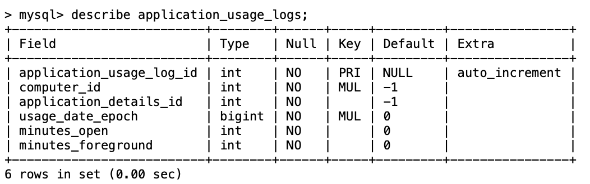
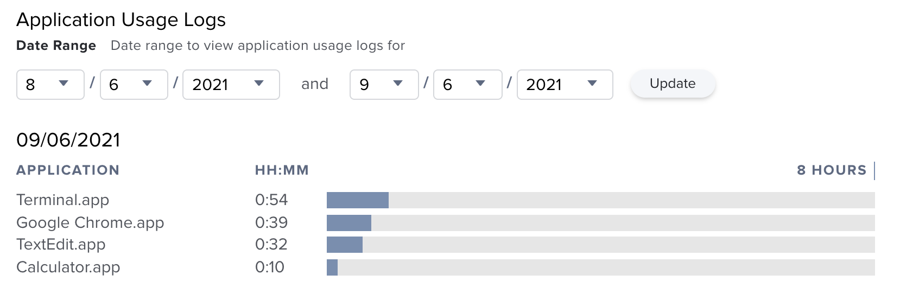

Application usage data on macOS can easily be misinterpreted. Even the native Screen Time service does not do a great job determining which applications were truly ‘in use’ and for how long.  
More on this here: [Spelunking macOS ScreenTime App Usage with R](https://www.r-bloggers.com/2019/10/spelunking-macos-screentime-app-usage-with-r/)

With that said, let’s take a quick review of how the macOS Jamf Pro framework collects application usage logs.

---

## Log Collection

One of the `JamfDaemon`'s primary responsibilities is monitoring application usage events and capturing statistics.

**Key locations:**
- LaunchDaemon:  
  `/Library/LaunchDaemons/com.jamf.management.daemon.plist`
- Jamf.app application bundle (includes JamfDaemon executable):  
  `/Library/Application Support/JAMF/Jamf.app/Contents/MacOS/JamfDaemon.app/Contents/MacOS/JamfDaemon`

Previously, application usage data was logged to `/Library/Application Support/JAMF/Usage/[capture-date]/[current-user].plist`

The basic syntax structure for each tracked application contained key-value pairs for elapsed mins/secs for foremost apps and apps that were loaded and running.

```sh
defaults read /Library/Application\ Support/JAMF/Usage/[capture-date]/[current-user].plist
```
```text
"/Applications/Google Chrome.app" = {
    foremost = 13;
    open = 2460;
    secondsforemost = 832;
    secondsopen = 147643;
    version = "91.0.4472.106";
};
```

Around Jamf Pro version 10.30.1, the application usage data was moved to:

```
/Library/Application Support/JAMF/usage_reports
```

The schema changed to JSON and now only contains a `secondsActive` key, which seems to collect the same data as the `secondsforemost` key from the older `.plist` structure.

```sh
cat /Library/Application\ Support/JAMF/usage_reports/2021-09-06 | jq
```
```json
{
  "appName": "Google Chrome",
  "appPath": "/Applications/Google Chrome.app/Contents/MacOS/Google Chrome",
  "secondsActive": 2259
}
```

It seems the JamfDaemon is monitoring application lifecycle using an `NSWorkspace` object, which watches Launch Services (`launchservicesd`) events. Running `/usr/bin/strings` on the JamfDaemon app bundle shows some plain text references:

```sh
/usr/bin/strings /Library/Application\ Support/JAMF/Jamf.app/Contents/MacOS/JamfDaemon.app/Contents/MacOS/JamfDaemon | grep -i NSWorkspace
```

Sample output:
```text
stopping listening for NSWorkspace events
starting to listen for NSWorkspace events
NSWorkspaceApplicationKey
Unable to set currently active process. NSWorkspace reports no frontmostApplication or menuBarOwningApplication
failed to update icon - NSWorkspace unable to set icon
NSWorkspace
```

Frontmost/foreground app state can be viewed, along with the app’s unique ASN number, by calling `/usr/bin/lsappinfo` while interactively switching frontmost apps in the macOS GUI. This demonstrates the type of events being watched, such as `kLSNotifyBecameFrontmost` and `LSMenuBarOwnerASN`.

```sh
/usr/bin/lsappinfo listen +becameFrontmost forever
```

Sample notification:
```text
Notification: kLSNotifyBecameFrontmost time=09/06/2021 19:23:46.696 dataRef={ "LSOtherASN"=ASN:0x0-0x11011:, "LSMenuBarOwnerASN"=ASN:0x0-0xa40a4:, "LSMenuBarOwnerApplicationSeed"=455, "ApplicationType"="Foreground", "LSASN"=ASN:0x0-0xa40a4:, "LSFrontApplicationSeed"=495, "CFBundleIdentifier"="com.apple.TextEdit" } affectedASN="TextEdit" ASN:0x0-0xa40a4:  context=0x0 sessionID=186a8 notificationID=0x7f86c2704d20
```

`lsappinfo` can also give insight into the launch time of a specific app:

```sh
/usr/bin/lsappinfo info -only kLSLaunchTimeKey TextEdit
```
Sample output:
```text
"LSLaunchTime"=2021/09/06 14:38:37
```

---

## Log Submission

Once the macOS device completes an inventory update, the captured JSON data will be sent to the Jamf Pro server and stored in the following MySQL database table: `application_usage_logs`.

<!---->



---

## Log Review

Checking the device’s inventory record in Jamf Pro will show all captured usage data. See the [Jamf Pro Administrator’s Guide](https://www.jamf.com/resources/product-documentation/jamf-pro-administrators-guide/).

<!---->



Usage data can also be returned by the Jamf Pro Classic API on a per-device basis using the `computerapplicationusage` endpoint resource.

Log retention in Jamf Pro is set under **System Settings > Log Flushing**. Depending on database restrictions and performance, it may not be possible to extend the log retention